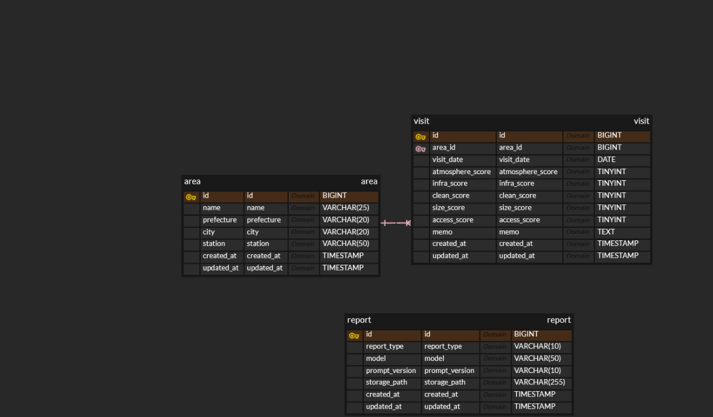

# ERD

## Version

- V1

## ERD

## Tables

- Area
- Visit
- Report
- ReportArea

## Design Notes

- Visit는 Area를 참조한다. (1:N)
- AI Report는 Cloud Storage에 저장하고 DB에는 경로만 저장한다.
- Visit 데이터는 Source of Truth로 간주한다.
- AI는 데이터를 생성하지 않고, 데이터를 해석한다.
- Area는 `deleted_at`을 사용해 Soft Delete한다.
- Area의 `(prefecture, city, name)` 조합은 UNIQUE이며 `station`은 중복 판단에서 제외한다.
- ReportArea는 Report와 생성 대상 Area를 연결한다. 두 FK를 복합 PK로 사용하고 `display_order`로 리포트 내 지역 순서를 보존한다.
- ReportArea는 Visit 등록 시점이 아니라 Report 생성 시점에만 저장한다.
- AREA는 1건, COMPARE는 2~5건, ALL은 생성 당시 모든 Area 관계를 저장하며 SUMMARY는 관계를 저장하지 않는다.
- `town-ai-v1.sql`을 현재 스키마 정의 기준으로 사용한다. PNG와 XLSX는 다음 다이어그램 갱신 시 동기화한다.

## Files

- `town-ai-v1.sql`
- `town-ai-v1.png`
- `town-ai-v1.xlsx`
