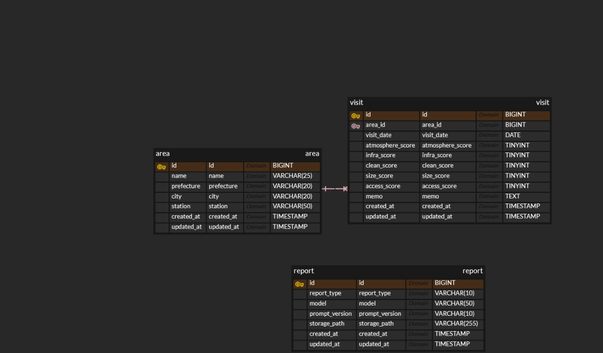

# ERD

## Version

- V1

## ERD

## Tables

- Area
- Visit
- Report
- ReportArea
- LineWebhookEvent
- LineVisitDraft

## Design Notes

- Visit는 Area를 참조한다. (1:N)
- AI Report는 Cloud Storage에 저장하고 DB에는 `reports/v1/{reportType}/{filename}_{yyyy-MM-dd}_{reportId}.md` 형식의 객체 경로만 저장한다.
- Visit 데이터는 Source of Truth로 간주한다.
- AI는 데이터를 생성하지 않고, 데이터를 해석한다.
- Area는 `deleted_at`을 사용해 Soft Delete한다.
- Area의 `(prefecture, city, name)` 조합은 UNIQUE이며 `station`은 중복 판단에서 제외한다.
- ReportArea는 Report와 생성 대상 Area를 연결한다. 두 FK를 복합 PK로 사용하고 `display_order`로 리포트 내 지역 순서를 보존한다.
- ReportArea는 Visit 등록 시점이 아니라 Report 생성 시점에만 저장한다.
- AREA는 1건, COMPARE는 2~5건, ALL은 생성 당시 모든 Area 관계를 저장하며 SUMMARY는 관계를 저장하지 않는다.
- Entity PK는 `BIGINT AUTO_INCREMENT`를 사용한다. `report_area`는 두 FK를 복합 PK로 사용하므로 별도 ID를 생성하지 않는다.
- Visit의 다섯 점수는 DB와 Backend 모두에서 0 이상 10 이하로 검증한다.
- `visit_date`는 사용자가 방문한 날짜이므로 시각 없이 `DATE`로 저장한다.
- `created_at`, `updated_at`, 만료 및 처리 시각은 정렬·감사·재시도 판단에 필요하므로 초 단위 `TIMESTAMP`로 저장한다. 밀리초는 사용하지 않는다.
- DB와 애플리케이션은 UTC를 사용한다. API는 UTC ISO8601 형식으로 반환하고 Frontend가 표시할 때 사용자 시간대로 변환한다.
- `report.prompt_version`은 `visit-parser-v2`처럼 10자를 넘는 버전을 보존할 수 있도록 `VARCHAR(30)`을 사용한다.
- `report.storage_path`는 Report ID 선점 과정에서 같은 DB Transaction 안에서만 일시적으로 `NULL`일 수 있다. Transaction이 Commit된 Report에는 반드시 최종 경로가 존재하도록 Backend가 보장한다.
- `report.source_webhook_event_id`는 LINE에서 생성한 Report에만 저장하는 선택적 UNIQUE 멱등 Key이다. 같은 Cloud Tasks 이벤트가 재처리되면 기존 Report를 재사용한다.
- `line_webhook_event`는 LINE 이벤트의 최소 처리 정보와 상태를 저장하고 `webhook_event_id`를 PK로 사용해 중복 수신을 방지한다.
- `line_webhook_event.event_type`은 `FOLLOW`, `TEXT_MESSAGE`, `POSTBACK`을 지원한다. `FOLLOW`는 메시지와 Postback Payload를 저장하지 않는다.
- `line_webhook_event.processing_started_at`은 작업 중 Process 종료를 감지하는 처리 Lease 기준으로 사용한다.
- `line_visit_draft`는 LINE 자연어 입력의 파싱 결과를 최대 24시간 보관한다. 필수 값이 모두 유효한 Draft만 확인할 수 있다.
- 기존 Area를 식별하지 못한 경우 `area_name`, `area_prefecture`, `area_city`, `area_station`에 신규 Area 후보 Snapshot을 보존한다.
- `area_registration_required`가 `TRUE`인 확인 가능 Draft는 저장 시 Area와 Visit을 하나의 Transaction으로 함께 생성한다.
- `line_visit_draft.warnings`는 경고가 없을 때도 빈 JSON 배열을 저장하며 `NULL`을 허용하지 않는다.
- Draft 확인 시 Visit 저장과 Draft의 `CONFIRMED` 전환을 하나의 DB Transaction으로 처리하며 `confirmed_visit_id`로 결과를 보존한다.
- `line_visit_draft.source_webhook_event_id`는 UNIQUE이며 재처리 시 기존 Draft를 조회해 재사용한다.
- `AWAITING_REVISION` Draft는 다음 LINE Text Message를 부분 수정 요청으로 처리한다. 해당 Event가 AI 호출 전에 `revision_webhook_event_id`로 Draft를 점유하면 `REVISION_PROCESSING`으로 전환하고, 수정된 새 Draft가 생성되면 이전 Draft는 `SUPERSEDED`로 전환한다.
- 수정 Text Message는 최초 선택한 원본을 `line_webhook_event.revision_source_draft_id`에 보존하고 자신의 `source_webhook_event_id`로 새 Draft를 생성한다. 원본이 취소·만료되거나 다른 수정이 먼저 처리되어도 재시도 시 일반 신규 입력으로 바뀌지 않는다.
- Draft가 `CONFIRMED`이면 `confirmed_visit_id`가 반드시 존재하고, 그 외 상태에서는 `NULL`이어야 한다.
- LINE User ID는 Draft 소유자 검증과 Push Message 전송에만 사용하고 API 응답 및 로그에 노출하지 않는다.
- LINE Draft는 생성 후 30일이 지나면 새 Webhook 처리 시 기회적으로 삭제한다. 이후 Draft가 참조하지 않는 30일 경과 `COMPLETED`·`FAILED` 이벤트를 삭제하며, 복구·점검 대상인 `RECEIVED`·`PROCESSING` 이벤트와 확인 결과인 Visit은 자동 삭제하지 않는다.
- `town-ai-v1.sql`을 현재 스키마 정의 기준으로 사용한다. PNG와 XLSX는 다음 다이어그램 갱신 시 동기화한다.

## Files

- `town-ai-v1.sql`
- `town-ai-v1.png`
- `town-ai-v1.xlsx`
